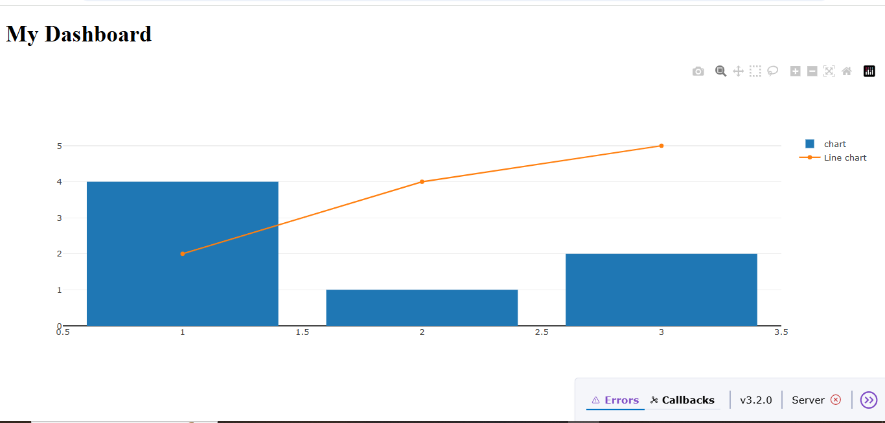

# 📊 My Dashboard 
 
 [](https://www.python.org/)  
[](LICENSE)  

 This is a simple interactive dashboard built using [Dash](https://dash.plotly.com/) (by Plotly).  
It displays a bar chart and a line chart on the same graph with labeled axes.

## 📸 Preview
  

## 🚀 Features
- Displays:
  - **Bar Chart** (sample data)
  - **Line Chart** (sample data)
- Customizable **title**, **x-axis**, and **y-axis** labels

## Project Structure
- `main.py` - Main file containing the Dash application

## 🛠️ How to Run
1. Download or clone this repository.
2. Install dependencies:
   ```bash
   pip install dash

   Run the app:
python main.py

Open your browser and go to:
http://127.0.0.1:8050/